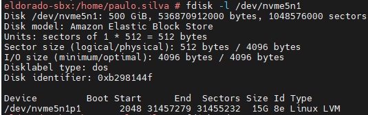
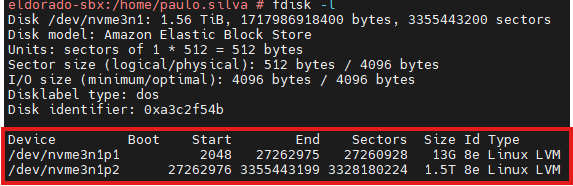
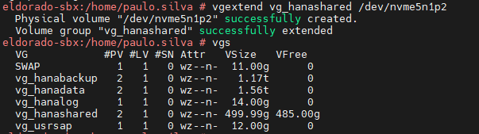
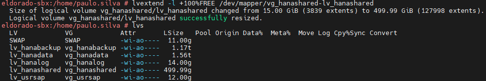
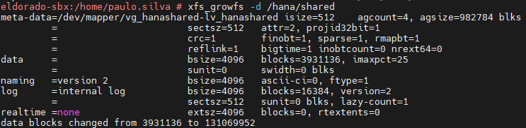
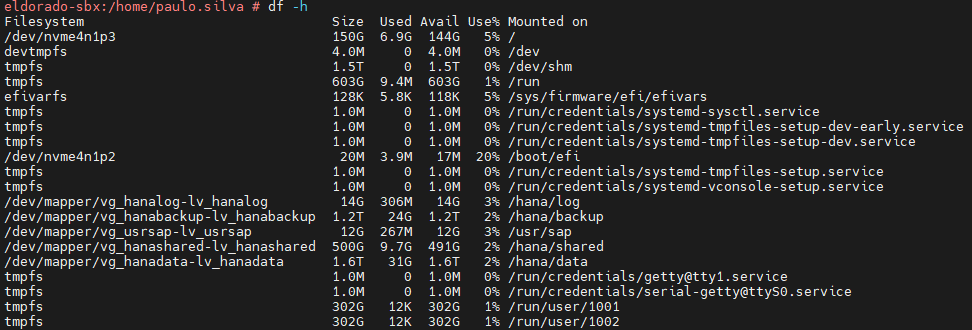

## Formatacao de Disco na AWS

FORMATANDO DISCO e EXTENDENDO O DISCO - OFICIAL

## FORMATAR UM NOVO DISCO ##
##Visualiza os discos

fdisk -l

##Formata o disco -  /dev/nvme7n1

fdisk /dev/nvme7n1

n

enter

enter

enter

enter

p

m

t

L

8e

p

w

##Visualiza os discos

fdisk -l

##Cria pasta temporario
mkdir /temporario

##Cria o PVS
pvcreate /dev/nvme7n1p1 
pvs

##Cria o VGS
vgcreate vgtemporario /dev/nvme7n1p1
vgs

##Cria LVS
lvcreate -l 100%FREE vgtemporario -n lvtemporario
lvs

##Formata o disco##
mkfs.xfs /dev/vgtemporario/lvtemporario

##Vsualiza info par colocar no FSTAB
blkid | grep vg_backup
blkid /dev/vgtemporario/lvtemporario

##Add informacao no FSTAB
vim /etc/fstabmkfs.
UUID="a7d6229d-8753-43a6-971a-1e95a6ddf6a9"   /backup      xfs     defaults,nofail 0 0
mount -a
df -hT

## EXTENDENDO O DISCO

Nesse exemplo estamos fazendo a extensão do filesystem (/hana/shared)

Ir na AWS e aumentar o disco com o tamanho necessario depois seguir o passo a passo abaixo para extender o filesystem

## Visualiza os discos

fdisk -l

# Procurar sempre o nova partição

Comando que visualiza se esta apresentando no servidor

-- fdisk -l /dev/nvme5n1  (Disco do Hana/shared) --

## Formata o dissco
fdisk /dev/nvme7n1
n
enter
enter
enter
enter
p
m
t
8e
p
w

## Como Ira aparecer
Device         Boot    Start        End    Sectors  Size Id Type
/dev/nvme5n1p1          2048   31457279   31455232   15G 8e Linux LVM
/dev/nvme5n1p2      31457280 1048575999 1017118720  485G 8e Linux LVM

## Extendendo o VGS
vgextend vg_hanashared /dev/nvme5n1p2

## Extendendoo LVS
lvextend -l +100%FREE /dev/mapper/vg_hanashared-lv_hanashared

## Extende o volume
xfs_growfs -d /hana/shared

## Visualizando se finalizou a extensao 
df -Th ver o tipo de partição

